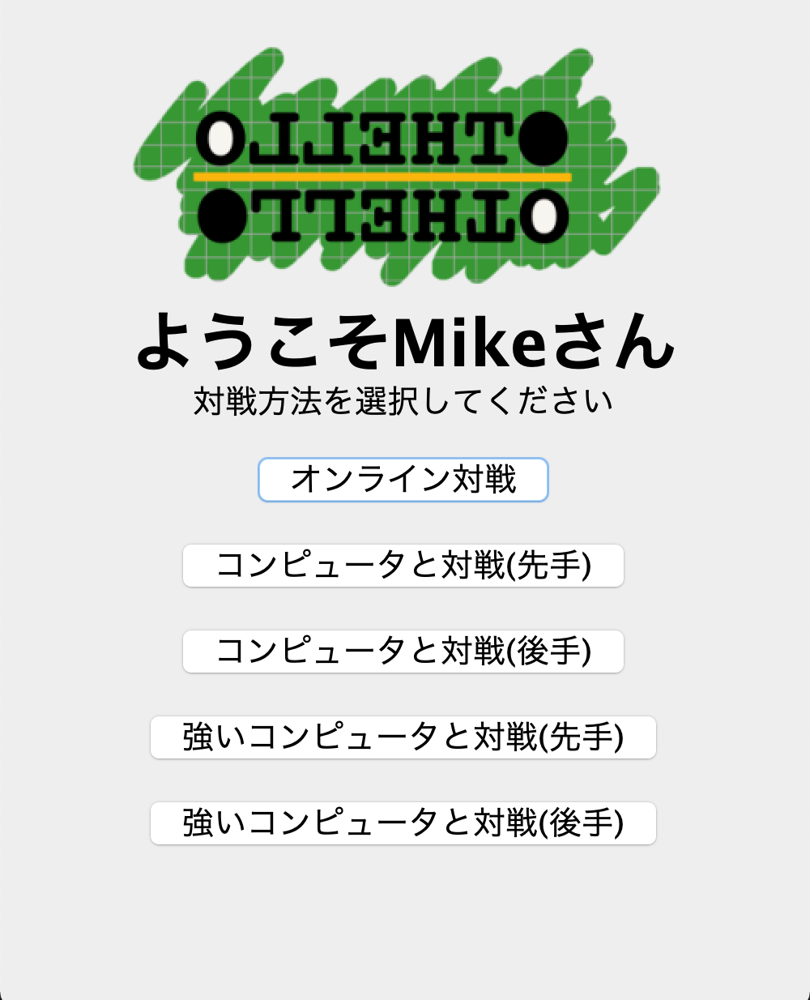

# OLLEHTO
* Othello GAME
* Choose Online or CPU(2Level，Strong or Weak)

## How to Start
1. compile ---> `sh compile_src.sh`
2. change current directory ---> `cd src`
3. run Server ---> `java ServerProgram`
4. run Client ---> `java ClientProgram {Server's IP address}`

|||
|:---:|:---:|
|StartPage|MainPage|